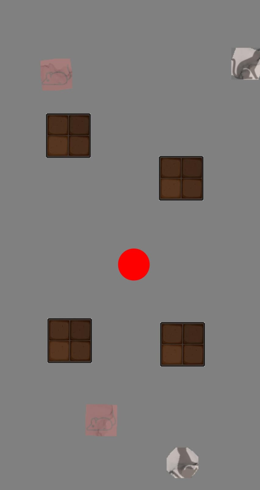

# Swiss Cheese CAPTCHA: A Novel Multi-barrier Mechanism for Bot Detection

### Introduction
Swiss Cheese CAPTCHA (SCCaptcha) is a multi-barrier CAPTCHA mechanism. In SCCaptcha, the user moves the ball from the center towards the upright image, going around the obstacles. User can guide the ball by tilting their mobile device appropriately. On hovering over the right image, SCCaptcha is passed; otherwise, if hovered over another image, SCCaptcha fails, prompting the user to try again. If the user fails to solve SCCaptcha in 25 seconds, SCCaptcha resets itself to a new one.

### Please don't forget to cite our paper. 
Ankit Gangwal, P. Sahithi Reddy, C.Y.K. Sagar. <br>
Swiss Cheese CAPTCHA: A Novel Multi-barrier Mechanism for Bot Detection. <br>
In Proceedings of the 40th ACM/SIGAPP Symposium On Applied Computing <br>
(ACM SAC 2025), in press, Sicily, Italy, March 31 - April 4, 2025.<br>

### People 
1. <a href="https://ciaoankit.github.io/">Ankit Gangwal</a>, International Institute of Information Technology, Hyderabad, India<br/>
2. <a href="http://github.com/psahithireddy">P. Sahithi Reddy</a>, International Institute of Information Technology, Hyderabad, India<br/>
3. <a href="http://github.com/95ych">C.Y.K. Sagar</a> International Institute of Information Technology, Hyderabad, India

## Usage Manual

### How to Start Server
Clone the repository and run the following commands:
```
pip install -r requirements.txt
./run.sh
```
### How to Start Client
- Connect a mobile device to the same network as the server.
- Once the server starts running, copy the corresponding URL and paste/open it in the mobile browser.

## Technical Details
### APIs

| Method | Endpoint         | Description                                                  | Associated Function |
|--------|------------------|--------------------------------------------------------------|------------------|
| GET    | /home            | Displays home page                                            | landing_page() |
| GET/POST | /puzzle        | - Creates the coordinates for obstacles and images <br>- Displays puzzle page | start() |
| POST   | /coordinates     | - Works to get coordinates of the device<br>- Redirects to /puzzle | coordinates() |
| POST   | /guess           | - Works to get the path of the user<br>- Verifies the path and answer<br>- Returns the result | guess() |


### Files - Description
| File | Description                                                  |
|----------|--------------------------------------------------------------|
| main.py | - Contains all the routes and calls all the needed verifications for SCCaptcha <br>  - Has verification functions to handle jumps and ball passing through obstacle|
| helper.py | - Contains all the helper functions for distance, dumping data, getting_min_points needed for verfication|
|coordinate_handler.py| - Contains all the functions for handling coordinates of the obstacle, box, and the ball|
|image_handler.py| - Contains all the functions for handling images like creating, deleting, naming|
|path_behaviour.py| - Contains all the functions for handling the path of the ball to differentiate between humans and robots using RMSE|
| /data/path_dump.json| - Location where the trajectories are appended for every new solve|
| /static/pics/temp | - where the current image thats rendered is stored, images > 2minutes old get deleted in the next run/solve | 

### Functions - Description

`box or images refers to images of animals, obs refers to obstacles, few functions are not mentioned here as they are self explanatory`
| Function | Description                                                  |
|----------|--------------------------------------------------------------|
| delete_img() | - Deletes database images that are older than few minutes|
| render_img() | - Takes coordinates from the start function and generates the complete image by laying entities on a transparent image |
| check_endpoint() | - For each path guessed, checks if any of the endpoint is reached among the 4 images|
| dist() | - Computes Euclidean Distance between two points  |
| inbox() | - Checks if the ball is in the margin threshold of the image |
| verify_path() | Verifies the path <br> - based on minimum acceptable number of points in the trajectory <br>- based on if there are huge jumps in the adjacent points in the trajectory <br> - distance between points and endpoint reached  <br> - if ball passed through obstacles (which is possible when trajectory is manually generated)  <br> - Human-like behaviour|
| get_area() | - Computes area around the image (box), which we want to set as valid area for ball to be in|
| get_box_coordinates() | - Computes the coordinates of the box/images for its placement on screen and returns values to start() function|
| ball_obs_overlap() | - Checks if the ball's coordinates overlaps with obstacles coordinates|


### Supporting Browsers

| Browser |Version | Support |
|------------|--------------|---------------------------------|
|Chrome for Android |120|&#x2705;|
|Safari on iOS* | 3.2 - 17.3 | ❌|
|Samsung Internet | 9.2 - 23 | &#x2705;
|Opera Mobile* | 73 | &#x2705;
|UC Browser for Android | 15.5 | &#xFFFD;|
|Android Browser* | 120 | &#x2705;
|Firefox for Android| 119 | ❌|


### WorkFlow
1. When a user visits the site, the user is allocated a unique ID in the backend server.
2. For each user ID, 4 obstacle locations and 4 SCCaptcha box locations are generated randomly and stored in a dictionary for the given user ID. 
3. A random image is picked from a (large) collection of images. The selected image is rotated to an angle of multiple of 90 degrees. The number of times the image should be rotated 90 degrees anticlockwise is stored as the SCCaptcha answer for that user ID. Similarly, obstacles are placed along the given coordinates, and the image is rendered.
4. The front end displays the image, and the user is asked to tilt the device to guide the ball to the upright/correct image. The user is given 25 seconds to solve SCCaptcha.
5. The frontend sends the ball's coordinates to the backend server at periodic intervals. The backend server checks if the end coordinates are within the valid area of the image. If yes, SCCaptcha is passed. If a user ends up in one of the wrong coordinates, SCCaptcha fails and restarts again.
6. Moreover, if no output from the sensor is observed, the server initiates a fallback mechanism within a few seconds.

### Screenshot

