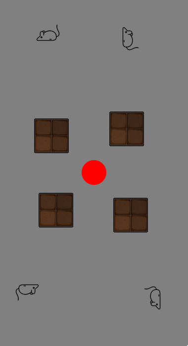

# ReCap

### Captcha Design



User moves the ball from the centre towards the upright image going around the obstacles. User can guide the ball by tilting their mobile device appropriately. On hovering over the right image, the captcha is passed, otherwise if hovered over other image, the captcha fails prompting the user to try again. If the user fails to solve the captcha in 10 seconds, the captcha resets itself to a new one.

### Workflow
1. When a user visits the site, in the backend server the user is allocated a unique id.
2. For each user id, 4 obstacle locations, and 4 captcha box locations are generated randomly and stored in a dictionary for the given user id. 
3. A random image is picked from a large collection of images. The selected image is rotated to an angle of multiple of 90 degrees. The no. times by which the image should be rotated 90 degrees anticlockwise is stored as the captcha answer for that user id. The image is sent to the frontend.

```py
@app.route('/', methods=['GET'])
def start():
    user_id = uuid.uuid1().int;
    user_data[user_id] = {}
    img_id = random.randint(0, 1)
    rotate_90_by = random.randint(0,3)
    org_img = Image.open(f"./static/pics/{img_id}.png")
    rotated_img = org_img.rotate(rotate_90_by*(-90)) 
    rotated_img.save("./static/pics/tmp.png")
    session['user_id'] = user_id
    # number = random.randint(1, 10)
    ans = (4-rotate_90_by)%4 
    # ans = rotate_90_by
    user_data[user_id]['ans'] = ans
    user_data[user_id]['rotate'] = rotate_90_by
    box_pos = []
    obs_pos = []
    for i, j in [(i,j) for i in [0,1] for j in [0,1]]:
        '''
        Select position from the L shape region
        '''
        sh = GC_HEIGHT//6 - offset
        sw = GC_WIDTH//6 - offset
        lh = GC_HEIGHT//2 - offset
        lw = GC_WIDTH//2 - offset
        borderw = GC_WIDTH//2 -offset -sw
        borderh = GC_HEIGHT//2 - offset -sh
        area_choice=random.choices([0,1,2],weights=[sh*sw,(lh-offset)*sw,(lw-offset)*sh])
        box_x=0
        box_y=0
        if area_choice[0]==0:
            box_x =  GC_WIDTH//2 + pow(-1,i+1)*random.randint(borderw,borderw+sw)
            box_y =  GC_HEIGHT//2 + pow(-1,j+1)*random.randint(borderh,borderh+sh)
        elif area_choice[0]==1:
            box_x = GC_WIDTH//2 + pow(-1,i+1)*random.randint(borderw,borderw+sw)
            box_y = GC_HEIGHT//2 + pow(-1,j+1)*random.randint(offset,lh)
        else:
            box_x = GC_WIDTH//2 + pow(-1,i+1)*random.randint(offset,lw)
            box_y = GC_HEIGHT//2 + pow(-1,j+1)*random.randint(borderh,borderh+sh)
        # box_x = GC_WIDTH//2 + pow(-1,i+1)*random.randint(offset,lw)
        # box_y = GC_HEIGHT - offset
        print(sw,sh,borderw+sw,borderh+sh,GC_WIDTH,GC_HEIGHT)
        print((i,j),area_choice,box_x,box_y) 
        box_pos.append((box_x,box_y))

        obs_x = GC_WIDTH//2 +  pow(-1,i+1)*random.randint( offset2, GC_WIDTH//3  - offset)
        obs_y = GC_HEIGHT//2 + pow(-1,j+1)*random.randint( offset2, GC_WIDTH//3  - offset)
        obs_pos.append((obs_x,obs_y))
        # obstacle_pos.append(( offset + random.randint(i*(GC_WIDTH//2),  (i+1)*(GC_WIDTH)),
        #                 ( offset + random.randint(j*(GC_HEIGHT//2),  (j+1)*(GC_HEIGHT))) ))
    user_data[user_id]['obs'] = obs_pos
    user_data[user_id]['captcha_box'] = box_pos 
    return render_template('index.html',offset=offset,offset2=offset2,gcheight = GC_HEIGHT,gcwidth=GC_WIDTH,box_pos=box_pos,obs_pos=obs_pos)
```
4. The frontend receives an image, obstacle coordinates, and captcha box coordinates from the backend for that specific user. It creates 4 blocks of images, ith block is rotated 90 degrees by i times ( i in [0,3]) and is placed along the given coordinates.
5. Similarly obstacles are placed along the given coordinates sent by the backend server.
5. The frontend javascript makes use of Generic Sensor api which uses gyroscope sensor present in mobile devices to find the orientation of the device.
6. The gyroscope readings received from the api are used to move the ball in the website.
7. Collision between obstacles and boundary of the game container are taken care by frontend javascript.
```js
	if ('Accelerometer' in window) {
			const acc = new Accelerometer({frequency: 60});
			acc.start();
			let ae = acc.addEventListener('reading', async function moveBall(e) {
				accx = acc.x;
				accy = acc.y;
				// console.log(x, y)
				let ballLeft = ball.offsetLeft - accx * 5;
				let ballTop = ball.offsetTop + accy * 5;
				let f = false;
				if (ballLeft <= 0 || ballLeft + ball.offsetWidth >= gameContainer.offsetWidth) {
					if ((ballTop <= 0 || ballTop + ball.offsetHeight >= gameContainer.offsetHeight) && !f) {
						return;
					}
					ball.style.top = ballTop + "px";
					f = true;

				}
				else if ((ballTop <= 0 || ballTop + ball.offsetHeight >= gameContainer.offsetHeight) && !f) {
					if (ballLeft <= 0 || ballLeft + ball.offsetWidth >= gameContainer.offsetWidth) {
						return;
					}
					ball.style.left = ballLeft + "px";
					f = true;
				}
				for (var i=0;i<4;i++){
					b = bricks[i]

					ballTop = ball.offsetTop ;
					if(ballLeft + ball.offsetWidth > b.offsetLeft && ballLeft < b.offsetLeft+brickWidth &&
					   ballTop + ball.offsetHeight > b.offsetTop && ballTop  < b.offsetTop+brickHeight) {
						// console.log(b);
						ballLeft = ball.offsetLeft + acc.x ;
						ball.style.left = ballLeft + "px";
						f = true;
						break;
	
					}
					ballTop = ball.offsetTop + accy * 5;
					ballLeft = ball.offsetLeft;
					if(ballLeft + ball.offsetWidth > b.offsetLeft && ballLeft < b.offsetLeft+brickWidth &&
					   ballTop + ball.offsetHeight > b.offsetTop && ballTop  < b.offsetTop+brickHeight) {
						ballTop = ball.offsetTop - acc.y ;
						ball.style.top = ballTop + "px";
						f = true;
						break;
	
					}
					ballLeft = ball.offsetLeft - accx * 5;
				}
				if (!f) {
					ball.style.left = ballLeft + "px";
					ball.style.top = ballTop + "px";
				}
			});
		} else {
			console.error('Accelerometer not supported');
		}
```
7. When user visits the site, parallelly the coordinates of the ball are recorded at 16Hz and stored in path.
```js
		setInterval(function(){
			path.append([(parseInt(ball.style.left.replace(/px/, "")) ),(parseInt(ball.style.top.replace(/px/, "")) )])
		}, 62)
```
8. Once the ball is over an image, a timers begins, if its still over the image after 2 seconds, the image id of it and the recorded path are sent to the backend.
```js
if (time > tlimit) {
	const requestOptions = {
		method: 'POST',
		headers: {'Content-Type': 'application/json'},
		body: JSON.stringify({guess: i, path: path})
	};
	fetch("guess", requestOptions)
		.then(response => response.json())
		.then(data => responseHandler(data))
		.catch(error => console.error('Error:', error));
}
```
9. First the image id is checked with ans of the user. If it matches, the recorded path is verfied as described in `prevention from attackers`, if it's a valid path, the user is redirected to their dashboard. Else the captcha is failed, and the user is prompted to try again.

10. The user should complete the captcha within 25 seconds, else the captcha gets reloaded.
```js
setTimeout(function () {
		 	location.reload();
}, 25000);
```


#### Prevention from attackers

This captcha is designed keeping in mind various automated bots. The difficulty lies recognizing the upright image and finding a path to it avoiding the obstacles. The captcha image is randomly picked from a large collection, rotated at some random multiple of rightangle, and is sent to the frontend which places 4 rotated images in the captcha marked by unique ids. Both the captcha box id on which the ball hovers and the path taken by the ball tracked at a particular frequency is sent to the backend server. The path taken by the ball is verified in the backend server, making sure that distance two adjacent track points are less than a given threshold (set as max velocity of ball/ frequency of tracking). Then the end point the track is verified whether it lies in the correct upright image.


```python
def verify_path(path,user_id):
    obs = user_data[user_id]['obs']
    captcha_box = user_data[user_id]['captcha_box'][user_data[user_id]['ans']]
    pathlen = len(path)
    if pathlen <= 2:
        return False
    prevpoint = path[0]
    for i in range(1,pathlen):
        for corner in obs:
            if inbox(path[i],corner):
                return False
        dist_trav = dist(prevpoint,path[i])
        if dist_trav > THRESHOLD:
            return False
        prevpoint = path[i]
    if not inbox(path[-1],captcha_box):
        return False
    return True
```

### Why ReCaptcha
For captchas like select the so called images in the grid below, there are certain problems. Nowadays we have plenty of computer vision models which can identify them and complete the captcha. Sometimes its not user friendly to older age groups, who have trouble identifying things, or not knowing what the object is.

In ReCaptcha, the interface is user-friendly, you need to just know which image is in it's correct upright position, and tilt the device to guide the ball over it, which is playfully fun enough. 

### How is it safer from attackers
In the traditional captcha, its just enough for the ml models to recognise the image, once its recognised, the box is clicked and it's done. But here, in order, we need to build a model which detects whether the object is upright or not, once it's done it should get a path from the ball to the captcha box, paving it's way around the obstacles. These barriers make the automation of solving the captcha more difficult than the traditional ones. The upright detection model was chosen based on the study that there are certain class of images that are easy for humans to orient but harder for machines to orient (https://dl.acm.org/doi/10.1145/1526709.1526822). We will using images from this class for our tasks.

### Cons
Since we are using Generic sensor api, it will only work on chromium based browsers and non-ios devices which have gyroscope sensors.
Unlike other captchas tasks which mostly involves clicking the image, here the user has to put in more effort to pass the captcha.
