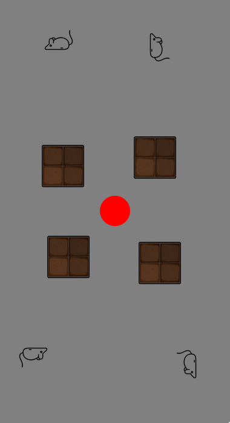

# ReCap


## Description
User moves the ball from the centre towards the upright image going around the obstacles. User can guide the ball by tilting their mobile device appropriately. On hovering over the right image, the captcha is passed, otherwise if hovered over other image, the captcha fails prompting the user to try again. If the user fails to solve the captcha in 10 seconds, the captcha resets itself to a new one.

## How to Run
Clone the repository and run the following commands
```
pip install -r requirements.txt
python main.py
```

## APIs

| Method | Endpoint         | Description                                                  | Associated Function |
|--------|------------------|--------------------------------------------------------------|------------------|
| GET    | /home            | Display home page                                            | landing_page() |
| GET/POST | /puzzle        | - Creates the coordinates for obstacles and images <br>- Display puzzle page | start() |
| POST   | /coordinates     | - Works to get coordinates of the device<br>- Redirects to /puzzle | coordinates() |
| POST   | /guess           | - Works to get the path of the user<br>- Verifies the path and answer<br>- Returns the result | guess() |


## Files - Functions
| File | Description                                                  |
|----------|--------------------------------------------------------------|
| main.py | - Contains all the routes and calls all the needed verifications for the captcha <br>  - has verification functions of jumps and ball passing through obstacle|
| helper.py | - Contains all the helper functions for the captcha for distance, dumping data, getting_min_points needed for verfication|
|coordinate_handler.py| - Contains all the functions for handling coordinates of the obstacle, box and the ball|
|image_handler.py| - Contains all the functions for handling images like creatig, deleting, naming|
|path_behaviour.py| - Contains all the functions for handling the path of the ball to differentiate between humans and robots using RMSE|
|path_analysis.py | - Analyse the path such the parameters can be tuned &  paths can be compared, independent of the backend|

## Functions

`box or images refers to images of animals, obs refers to obstacles, few functions are not mentioned here as they are self explanatory`
| Function | Description                                                  |
|----------|--------------------------------------------------------------|
| delete_img() | - Deletes database images which are older than few minutes|
| render_img() | - Takes coordinates from start function and generates the complete image by laying animals on a transparent image |
| check_endpoint() | - For each path guessed, checks if any of the endpoint is reached among 4 images|
| dist() | - Computes Euclidean Distance between two points  |
| inbox() | - Checks if the ball is in the margin threshold of the image |
| verify_path() | Verifies the path <br> - based on path length <br> - distance between points and endpoint reached  <br> - by calling inbox <br> - Number of valid datapoints|
| get_area() | - Computes area around the image (box) which we want to set as valid area for ball to be in|
| get_box_coordinates() | - Computes the coordinates of the box/images for its placement on screen and returns values to start() function|
| ball_obs_overlap() | - Checks if the ball and obstacle overlap by seeing if point is in rectangle|


## Supporting Browsers

| Browser |Version | Support |
|------------|--------------|---------------------------------|
|Chrome for Android |120|&#x2705;|
|Safari on iOS* | 3.2 - 17.3: | ❌|
|Samsung Internet | 9.2 - 23: | &#x2705;
|Opera Mobile* | 73: | &#x2705;
|UC Browser for Android | 15.5: | &#xFFFD;|
|Android Browser* | 120: | &#x2705;
|Firefox for Android| 119 | ❌|


## WorkFlow
1. When a user visits the site, in the backend server the user is allocated a unique id.
2. For each user id, 4 obstacle locations, and 4 captcha box locations are generated randomly and stored in a dictionary for the given user id. 
3. A random image is picked from a large collection of images. The selected image is rotated to an angle of multiple of 90 degrees. The no. times by which the image should be rotated 90 degrees anticlockwise is stored as the captcha answer for that user id. Similarly obstacles are placed along the given coordinates and the image is rendered.

4. The frontend displays the image and the user is asked to tilt the device to guide the ball to the upright image. The user is given 10 seconds to solve the captcha.

5. The frontend sends the coordinates of the device to the backend server. The backend server checks if the coordinates are within the valid area of the image. If the coordinates are within the valid area, the coordinates are stored in a list. If the coordinates are not within the valid area, the coordinates are discarded.


## Why ReCaptcha
For captchas like select images in the grid below, there are certain problems. Nowadays we have plenty of computer vision models which can identify them and complete the captcha. 

In ReCaptcha, the interface is user-friendly, you need to just know which image is in it's correct upright position, and tilt the device to guide the ball over it, which is playfully fun enough. 

## How is it safer from attackers
In the traditional captcha, its just enough for the ml models to recognise the image, once its recognised, the box is clicked and it's done. But here, in order, we need to build a model which detects whether the object is upright or not, once it's done it should get a path from the ball to the captcha box, paving it's way around the obstacles. These barriers make the automation of solving the captcha more difficult than the traditional ones. The upright detection model was chosen based on the study that there are certain class of images that are easy for humans to orient but harder for machines to orient (https://dl.acm.org/doi/10.1145/1526709.1526822). We will using images from this class for our tasks.

## Cons
Since we are using Generic sensor api, it will only work on chromium based browsers and non-ios devices which have gyroscope sensors.
Unlike other captchas tasks which mostly involves clicking the image, here the user has to put in more effort to pass the captcha.
